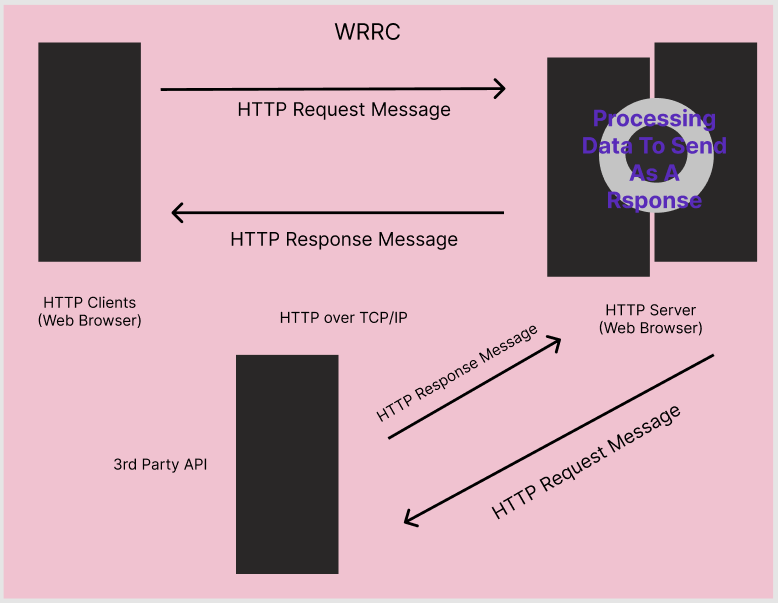
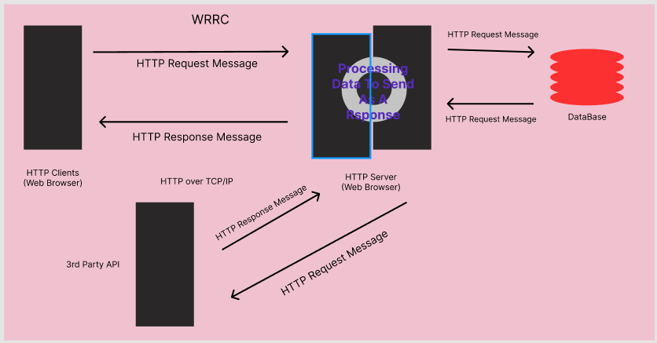

# Movies-Library - v1.1.1

**Author Name**: Mohammad Lebzo

## WRRC (task 11)

## WRRC (task 12)

## WRRC (task 13)

## Overview

## Getting Started
<!-- What are the steps that a user must take in order to build this app on their own machine and get it running? -->
***To build a new one:***
- Make new repository.
- Clone the repository.
- Run the command "npm init -y".
- Then run the command "npm i express".
- Requiring express
- Start assigning paths for the app (home, fav, etc..) and handling  them.
- Formatting the data.
- Adding a port listener function.
- Calling the paths for testing.

***To just copy this one and get it running:***
- Clone the repository.
- Run the command "npm i express".
- Run command "npm start" in order to start the server.
- Enter one of these URLs according to what you want to check:
    - "http://localhost:3000/"  ==> Home Page.
    - "http://localhost:3000/favorite"  ==> Favorite Page.
    - "http://localhost:3000/trending"  ==> Trending Page with data retrieved from a 3rd party API.
    - "http://localhost:3000/search?query="name of the movie""  ==> Search option with data retrieved from a 3rd party API.
    - "http://localhost:3000/discover?sort_by="sorting method""  ==> Discover option with data retrieved from a 3rd party API.
    - "http://localhost:3000/upcoming"  ==> Upcoming Page with data retrieved from a 3rd party API.
    - "http://localhost:3000/postMovieData"  ==> Used to add data to the database.
    - "http://localhost:3000/getMovieData"  ==> Used to get data from the database.

    
**Note: if you entered anything else you will be met with a status code "404", Page not found.**

## Project Features
<!-- What are the features included in you app -->
- **Home** path, currently just tells you that your at "the home path" as there is nothing for it for now.
- **Favorite** path where favorites are going to be shown(in the future, still under construction)
- **Error handling** for the status 404 and 500.
- **Trending** path, which gives the user the trending movies form an API called "*The Movie Database*".
- **Search** path, which allows the user to search for movies by name form an API called "*The Movie Database*".
- **Discover** path, which allows the users to discover movies by sorting them at they like by specifying the sorting keyword form an API called "*The Movie Database*". ( **Allowed Values**: , popularity.asc, popularity.desc, release_date.asc, release_date.desc, revenue.asc, revenue.desc, primary_release_date.asc, primary_release_date.desc, original_title.asc, original_title.desc, vote_average.asc, vote_average.desc, vote_count.asc, vote_count.desc, default: popularity.desc).
- **Upcoming** path, which shows the user some of the upcoming movies provided by an API called "*The Movie Database*".
- **PostMovieData** path, which is used to add data to the database.
- **GetMovieData** path, which is used to get data from the database.
- An **error handler** for when the server can't retrieve data from the database.