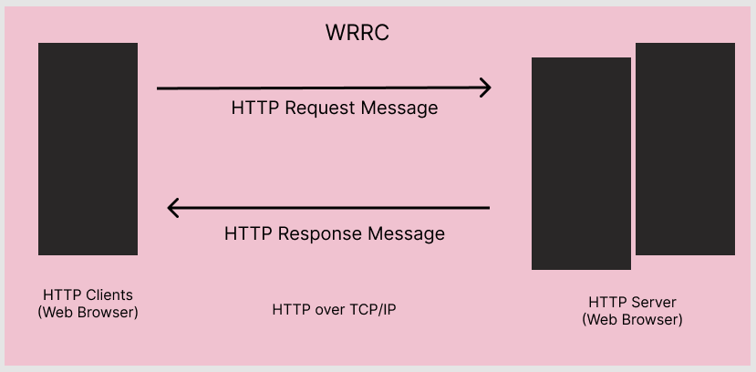

# Movies-Library - v1.0.0

**Author Name**: Mohammad Lebzo

## WRRC

## Overview

## Getting Started
<!-- What are the steps that a user must take in order to build this app on their own machine and get it running? -->
- Make new repository.
- Clone the repository.
- Run the command "npm init -y".
- Then run the command "npm i express".
- Requiring express
- Start assigning paths for the app (home, fav, etc..) and handling  them.
- Formatting the data.
- Adding a port listener function.
- Calling the paths for testing.

## Project Features
<!-- What are the features included in you app -->
- Home path where the data of the json file will be formatted and shown.
- Favorite path where favorites are going to be shown(in the future, still under construction)
- Error handling for the status 404 and 500.